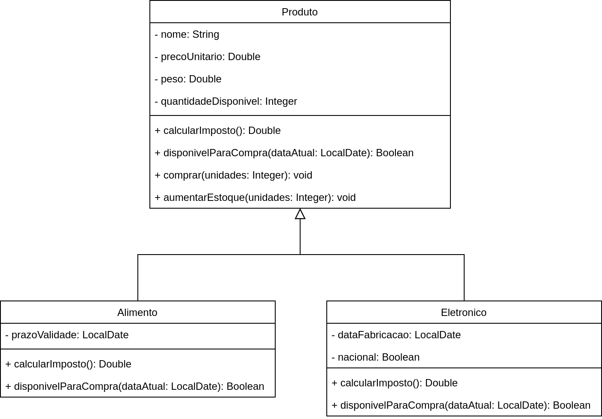

# Exercício Herança

## Orientações Gerais: 🚨
1. Utilize **apenas** tipos **wrapper** para criar atributos e métodos.
2. **Respeite** os nomes de atributos e métodos definidos no exercício.
3. Tome **cuidado** com os **argumentos** especificados no exercício.
   **Não** adicione argumentos não solicitados e mantenha a ordem definida no enunciado.
4. Verifique se **não** há **erros de compilação** no projeto antes de enviar.
5. As classes devem seguir as regras de encapsulamento.
6. Deixe um **construtor vazio** para utilização nos testes unitários.

## Diagrama de classe

## 🛒 **Classe: `Produto`**

### 🎯 **Objetivo**
Implemente a classe `Produto` conforme as especificações abaixo. Essa classe representa um produto genérico com funcionalidades de cálculo de imposto, verificação de disponibilidade, compra e atualização de estoque.

### 💰 **Métodos Públicos**

1. **`public Double calcularImposto()`**
    - Calcula o valor do imposto a ser pago sobre o produto, aplicando uma fração de **5%** sobre o valor do produto.

2. **`public Boolean disponivelParaCompra(LocalDate dataAtual)`**
    - Verifica se o produto pode ser adquirido pelo cliente, considerando que:
        - A quantidade disponível em estoque seja maior que zero.
    - Retorna `true` se o produto estiver disponível, `false` caso contrário.

3. **`public void comprar(Integer unidades)`**
    - Simula a compra de um determinado número de unidades do produto, atualizando a quantidade disponível em estoque.
    - A compra só será realizada se a quantidade solicitada for menor ou igual à quantidade disponível. Caso contrário, a compra não é realizada.

4. **`public void aumentarEstoque(Integer unidades)`**
    - Adiciona um determinado número de unidades ao estoque do produto.
    - Caso o valor informado seja negativo, a operação não deve ser realizada.

---

## 🍎 **Classe: `Alimento`** (herda de `Produto`)

### 🎯 **Objetivo**
Implemente a classe `Alimento`, que herda de `Produto`, e adicione funcionalidades específicas para produtos do tipo alimento.

### 💰 **Métodos Públicos**

1. **`@Override public Double calcularImposto()`**
    - Calcula o imposto sobre o alimento, aplicando uma fração de **3%** sobre o valor do produto.

2. **`@Override public Boolean disponivelParaCompra(LocalDate dataAtual)`**
    - Verifica se o alimento está disponível para compra, considerando:
        - A quantidade disponível em estoque.
        - Se a **data atual** é anterior à **data de validade**.
    - Retorna `true` se o produto estiver disponível, `false` caso contrário.

---

## 🔌 **Classe: `Eletronico`** (herda de `Produto`)

### 🎯 **Objetivo**
Implemente a classe `Eletronico`, que herda de `Produto`, com funcionalidades específicas para produtos eletrônicos.

### 💰 **Métodos Públicos**

1. **`@Override public Double calcularImposto()`**
    - Calcula o imposto sobre o produto eletrônico, aplicando:
        - **10%** se o produto for nacional.
        - **30%** se o produto for importado.

2. **`@Override public Boolean disponivelParaCompra(LocalDate dataAtual)`**
    - Verifica se o produto eletrônico pode ser vendido, considerando:
        - A quantidade disponível em estoque.
        - Se a **data de fabricação** é inferior a **5 anos** atrás, comparado à **data atual**.
    - Retorna `false` se a data de fabricação for igual ou posterior a 5 anos atrás.

---

### 📝 **Dicas e Considerações**
- Utilize o método .isAfter() da classe `LocalDate` para comparar datas.
  - https://www.geeksforgeeks.org/localdate-isafter-method-in-java-with-examples/

- Use a classe `ChronoUnit` para calcular diferenças de tempo em dias ou anos ao trabalhar com as datas de validade e fabricação. 
  - https://www.baeldung.com/java-months-difference-two-dates#2-the-chronounit-enum
  - O método `ChronoUnit.YEARS.between()` pode ser útil para calcular a diferença de anos entre duas datas.

- A lógica de disponibilidade e imposto varia entre os tipos de produtos. As subclasses `Alimento` e `Eletronico` devem sobrescrever os métodos de `Produto` conforme necessário.

---
