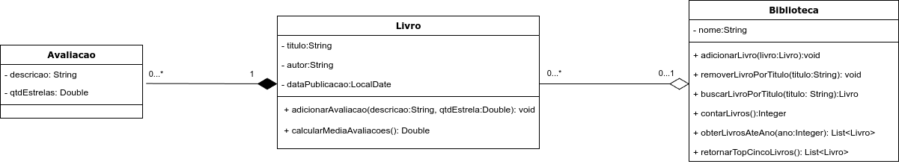

****

# Biblioteca de Livros

## Orientações Gerais: 🚨

1. Utilize **apenas** tipos **wrapper** para criar atributos e métodos.
2. **Respeite** os nomes de atributos e métodos definidos.
3. Tome **cuidado** com os **argumentos** especificados. **Não** adicione argumentos não solicitados
   e mantenha a ordem definida no enunciado.
4. Verifique se **não** há **erros de compilação** no projeto antes de enviar.
5. As classes devem seguir as regras de encapsulamento.
6. Deixe um **construtor vazio** para utilização nos testes unitários.

## Diagrama de Classes

---

### ⭐ Classe: `Avaliacao`

#### 🎯 Objetivo

Implemente a classe `Avaliacao`, que representa uma avaliação de um livro.

### 💰 Métodos Públicos

1. **`@Override public String toString()`**
   - **Descrição**: Retorna uma representação textual do objeto `Avaliacao`, mostrando detalhes da
     avaliação.

---

### 📖 Classe: `Livro`

#### 🎯 Objetivo

Implemente a classe `Livro`, que representa um livro e suas avaliações.

### 💰 Métodos Públicos

1. **`public void adicionarAvaliacao(String descricao, Double qtdEstrelas)`**
   - **Descrição**: Adiciona uma avaliação ao livro, com uma descrição e uma quantidade de
     estrelas.

   - **Condições**:
      - A descrição **não** pode ser `null` ou vazia.
      - A quantidade de estrelas **deve** estar entre 0 e 5

2. **`public Double calcularMediaAvaliacoes()`**
   - **Descrição**: Calcula a média de todas as avaliações do livro.

   - **Condições**:
      - Caso a lista estiver vazia deve retornar 0.

3. **`@Override public String toString()`**
   - **Descrição**: Retorna uma representação textual do objeto `Livro`, mostrando informações
     relevantes.

---

### 📚 Classe: `Biblioteca`

#### 🎯 Objetivo

Implemente a classe `Biblioteca` conforme as especificações abaixo. Esta classe fornece uma
estrutura para gerenciar livros e suas avaliações.

### 💰 Métodos Públicos

1. **`public void adicionarLivro(Livro livro)`**
    - **Descrição**: Adiciona um novo livro à biblioteca.
    - **Condições**:
        - O livro **não** pode ser `null`.
        - O título do livro **não** pode ser `null` ou vazio.
        - O autor do livro **não** pode ser `null` ou vazio.
        - A data de publicação do livro **não** pode ser `null`.

2. **`public void removerLivroPorTitulo(String titulo)`**
    - **Descrição**: Remove um livro da biblioteca com base no título fornecido.
    - **Condições**:
        - A remoção pelo titulo deve ser **case insensitive** (ou seja, não diferencia maiúsculas de
          minúsculas).

3. **`public Livro buscarLivroPorTitulo(String titulo)`**
    - **Descrição**: Busca um livro na biblioteca pelo título fornecido e retorna o objeto `Livro`.
    - **Condições**:
        - O título **não** pode ser `null` ou vazio.
        - A busca deve ser **case insensitive** (ou seja, não diferencia maiúsculas de minúsculas).

4. **`public Integer contarLivros()`**
    - **Descrição**: Retorna o número total de livros atualmente na biblioteca.

5. **`public List<Livro> obterLivrosAteAno(Integer ano)`**
    - **Descrição**: Retorna uma lista de livros publicados até o ano especificado.

### 🤓 Desafio! ⚡

6. **`public List<Livro> retornarTopCincoLivros()`**
    - **Descrição**: Retorna uma lista dos cinco livros com a melhor média de avaliação.
    - **Condições**:
        - Os livros devem ser retornados na ordem decrescente de média de avaliação.
        - Caso haja menos de cinco livros na biblioteca, deve retornar todos os livros disponíveis
          na ordem decrescente por média de avaliação.

---

## 💡 Dicas

1. Utilize o método `getYear()` da classe `LocalDate` para obter o ano de uma data.
2. Utilize `isBlank()` para verificar se uma String é vazia.
