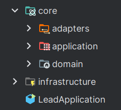

3
# API de Leads

# Mensagem do Tech Lead:
Pessoal, acabei de sair de uma call com o cliente e preciso que vocês adiantem o esqueleto do projeto.

O contexto é o seguinte: vamos ter uma **API de Leads**. No momento do **cadastro do lead**, deve ser feita uma **classificação automática** com base no **consumo médio mensal de energia elétrica (kWh)** informado. Essa classificação vai definir a **prioridade** na régua de comunicação (quem recebe contato mais rápido e personalizado).

Ainda não sabemos se os dados vão ficar em banco próprio ou vir de um microserviço externo, então deixem a solução preparada para os dois cenários.

Modelo de dados não precisa de muito detalhe agora — basicamente o lead tem identificador(inteiro ou UUID), dados de contato(nome, email, telefone), e o campo `consumoMedio`. A classificação gera a faixa, prioridade e sugestão de régua.
Faça apenas as validações básicas por hora, como email ter pelo menos um '@', valide o formato do CPF sem calcular, e verifique se o telefone é válido.

As **regras de classificação** são:

* **BAIXO**: consumo < 100 → prioridade 4 → “Nutrição mensal por e-mail”
* **MÉDIO**: 100 ≤ consumo < 300 → prioridade 3 → “Contato em até 72h + material educativo”
* **ALTO**: 300 ≤ consumo < 700 → prioridade 2 → “Contato em até 48h + proposta personalizada”
* **VIP**: consumo ≥ 700 → prioridade 1 → “Contato em até 24h + consultoria especializada”

Abaixo uma sugestao de organizacao:

Mandem bala e depois a gente alinha os detalhes de infra.